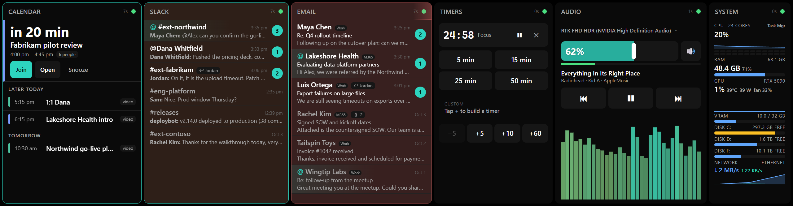
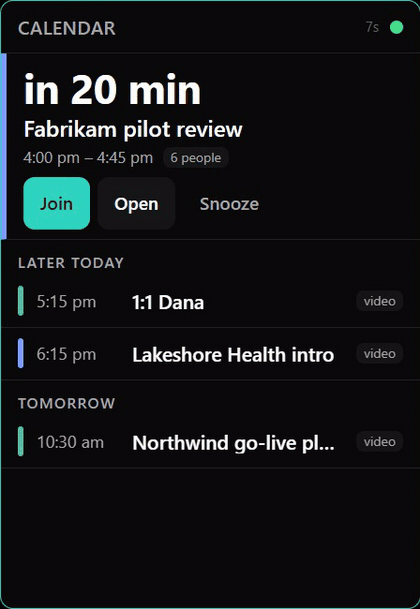
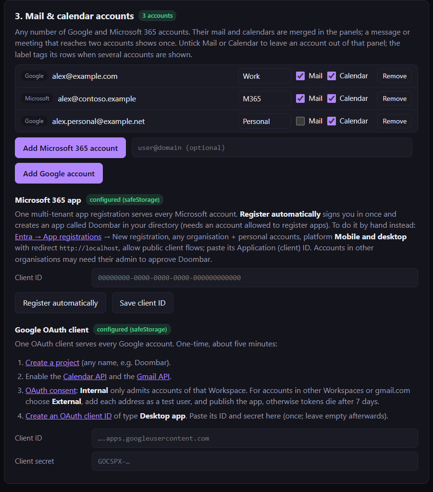

# Doombar

Kiosk dashboard for the 2560×666 touch strip. Six columns: Slack, calendar, email, timers, audio, system. Spec and decisions live in [ultrawide.md](ultrawide.md).



Tap a header to cycle its view (normal, focus, more); the panel flips like a card:



Screenshots use made-up data (see [Screenshots and demo data](#screenshots-and-demo-data)).

## Run

```bash
npm install
npm start                # finds the 2560x666 display; falls back to a window on the primary
npm run setup            # opens the setup window (Claude key, Slack tokens, mail/calendar accounts -> safeStorage)
npm run setup -- --from-env   # import secrets from .env.local into safeStorage
npm run setup -- --status     # which secrets are configured (never prints values)
npm run setup -- --accounts   # mail/calendar accounts and whether each is signed in
npm test
```

Secrets are read from `process.env` first (populated from `.env.local`), then from `secrets.json` in the data directory, where every value is encrypted with Electron `safeStorage`. Names: `ANTHROPIC_API_KEY`, `SLACK_APP_TOKEN`, `SLACK_USER_TOKEN`, `SLACK_BOT_TOKEN`, `GOOGLE_CLIENT_ID`, `GOOGLE_CLIENT_SECRET`, `GOOGLE_REFRESH_TOKEN` (the original single Google account), `MICROSOFT_CLIENT_ID`, and one `TOKEN_<ACCOUNT_ID>` per mail/calendar account added since. `.env.local` is a dev convenience; run `--from-env` once on the real machine and delete it.

Data directory: Electron `userData` when running the app, `./data` under plain Node. Override with `DOOMBAR_DATA`.

## Windows build

```bash
npm run dist            # cross-builds from WSL/Linux, no wine needed
```

Output in `dist/`:

- `dist/win-unpacked/` is the portable app: `Doombar.exe` plus `resources/`. Copy the whole folder somewhere stable (the login item points at this exe).
- `dist/Doombar-<version>-portable.exe` is a single-file variant that unpacks to `%TEMP%` on every launch. Slower to start and unsuitable for launch-at-login; use the folder.

First run on Windows creates `%APPDATA%\doombar\` with `config.json` (edit this one, it is hot-reloaded), `doombar.sqlite`, `secrets.json`, and logs.

**Auth setup:** run `Doombar.exe --setup`. A setup window opens: paste the Claude key and Slack tokens (each is tested before it is stored), and add mail/calendar accounts (see [Mail and calendar accounts](#mail-and-calendar-accounts)). Consent links are shown in the window with Open and Copy buttons as well as being opened in the default browser. Headless variants for scripting: `--setup --status`, `--setup --from-env`, `--setup --cli`, and the account flags below.

## Debug one service without the window

```bash
node services/system.js --dump
node services/timers.js --dump --action='start:{"minutes":5}'
node services/slack.js --dump --watch
npm run dump -- email
```

Standalone runs only see secrets from `.env.local` / the environment (no safeStorage outside Electron).

## Screenshots and demo data

`scripts/demo/` regenerates everything in `docs/media/` with made-up data (fictional companies and people, times relative to now). It boots the real app with the Slack, Email and Calendar services swapped for `scripts/demo/fixtures.js`, audio on the mock backend, and a throwaway data folder and config, so it runs beside an installed Doombar without touching its accounts or settings. With the strip attached it covers the real dashboard for about 20 s, then quits.

```bash
npx electron scripts/demo/run.js dashboard docs/media   # strip stills + calendar flip frames
node scripts/demo/encode.js docs/media ffmpeg           # frames -> calendar-flip*.mp4 / .gif (needs ffmpeg)
npx electron scripts/demo/run.js setup docs/media       # setup window: accounts, sign-in, calendars
```

The System panel shows the real machine's numbers.

## Layout

```
main/         Electron main: window placement, config watcher, secrets, sqlite, display schedule, IPC host
services/     one file per integration, all extend services/base.js (start/stop/getState/actions)
renderer/     one page, panel grid; panels/<name>.js mirrors services/<name>.js
preload.js    exposes exactly dashboard.subscribe(service, cb) and dashboard.action(service, name, payload)
services/sources/  one mail and one calendar source per provider (Gmail, Google Calendar, Outlook mail, Outlook calendar)
scripts/      setup.js, setup-slack.js, dump.js, win-audio.ps1 (audio fallback backend), demo/ (screenshots with fake data)
config.json   layout, channels, calendars, sender list, presets, thresholds; hot-reloaded
```

Adding a panel: one service file, one panel file, register both in `main/index.js` and `renderer/app.js`, add it to `layout` in config.

### Rearranging on the strip

Long-press any panel header (0.6 s) to unlock the layout. Drag a header to reorder, drag the accent bar in a gap to resize the two panels beside it, then tap **Done** (or wait 20 s). The result is written to `layout` in `config.json` by main after validation, so hand-edits and touch edits share one source of truth. Panel bodies ignore taps while unlocked.

The edit bar at the bottom also holds the theme picker: six palettes (Midnight, Nord, Rosé, OLED dark; Daylight, Paper light). With **Auto** on, the strip follows Windows' app mode and a swatch tap sets the dark or light pick (solid ring = showing now, dashed = the other pick). Turn Auto off and a swatch pins that theme. Saved to `display.theme` / `darkTheme` / `lightTheme`.

### Timers

Presets start in one tap. The chips below (`timers.steps`, default +5 / +10 / +60 and a minus) either build a custom duration, then **Start**, or, after tapping a running timer to select it, add and remove time from that timer. There is no numpad.

### Audio

Tap the device name to switch the default output (`IPolicyConfig`, the same call every "set default device" utility uses). The bar under the slider is the endpoint peak meter from `IAudioMeterInformation`, polled every `audio.meterMs`. Now-playing comes from the Windows media session API (`GlobalSystemMediaTransportControlsSessionManager`) through the PowerShell helper. The spectrum (`audio.visualizer`) is captured in the renderer via `getDisplayMedia`, which main answers with system loopback audio on Windows; the renderer stops the throwaway video track immediately. All four are PowerShell-backend features; the koffi backend degrades to volume, mute and transport.

### ACE player

The back of the Audio panel: tap the Audio header to flip to it and back (`views.audio`: `normal` | `ace`, `renderer/panels/audio-ace.js`); without an `ace` config section Audio is a plain panel, and `ace` can still be a layout column of its own. Plays tracks from the Doomgen server (`doomgen/`, `ace.url`, default `http://127.0.0.1:7788`); `services/ace.js` holds the `/ws` connection and queues play events while the server is down, `renderer/panels/ace.js` owns the `<audio>` element and registers with the Media Session API. Chips pick the source (Unheard, Liked, Radio, a theme); tap the prompt excerpt for the full prompt and the **Broken: Hiss / Noise / Garble** buttons. Nothing plays until the first tap or media key. Global hotkeys (`ace.hotkeys`): Ctrl+Alt+L like, Ctrl+Alt+D dislike (and next), Ctrl+Alt+B broken (moved to `_rejected`, re-rendered, and next). Below 420 px the panel drops the cover and counts.

### Theme and after hours

`display.theme` is `system` (follow Windows), `dark`, or `light`. Outside business hours the strip is veiled at `display.afterHoursDim` opacity (0 disables); a tap lifts it for a minute.

### Mail and calendar accounts

The Email and Calendar panels show any number of Google and Microsoft 365 accounts, merged: email rows from every account sorted together and grouped by client across accounts, meetings from every calendar on one timeline. A message delivered to two accounts (same `Message-ID`) shows once, counts as unread only while every copy is unread, and Mark read / Archive apply to all copies. A meeting in two calendars (same iCal UID and start) shows once. When more than one mail account is active, each email row carries a small account tag (the label, default the first part of the mail domain: `contoso` for `you@contoso.com`). If one account fails (expired sign-in, outage), a red line names it at the top of the panel and the other accounts keep updating.

Adding accounts, in the setup window (section 3) or from a terminal:



```bash
Doombar.exe --setup --register-microsoft      # once per install: creates the "Doombar" Entra app
Doombar.exe --setup --add-microsoft --login=you@contoso.com
Doombar.exe --setup --add-google              # another Google account (pick it in the account chooser)
Doombar.exe --setup --accounts                # list
Doombar.exe --setup --remove-account=<id>     # also deletes its token
```

From a source checkout use `npm run setup -- <flags>`, and set `DOOMBAR_CONFIG=%APPDATA%\doombar\config.json` if the installed app should see the result (a checkout's own config is the repo `config.json`).

- **Microsoft 365.** One multi-tenant app registration (any organisation plus personal Microsoft accounts) serves every Microsoft account. `--register-microsoft` signs you in through the Azure CLI's public client and creates it in your directory, as `az ad app create` would; the account needs permission to register apps. To make it by hand: Entra admin centre → App registrations → New registration, supported accounts "any organisational directory and personal Microsoft accounts", platform *Mobile and desktop* with redirect `http://localhost`, *Allow public client flows* on; paste the Application (client) ID into setup. Delegated permissions requested at sign-in: `User.Read`, `Mail.ReadWrite` (mark read, archive), `Calendars.Read`, `offline_access`. Sign-in is authorization code + PKCE on a loopback redirect, no client secret. An account in another organisation may hit "needs admin approval" if that tenant blocks user consent; its admin approves Doombar once. Refresh tokens rotate on use and are saved back each time; they last 90 days from the last use, so an account that polls never expires.
- **Google.** All Google accounts share the one OAuth client (`GOOGLE_CLIENT_ID`/`SECRET`). An *Internal* consent screen only admits accounts of that Workspace; for accounts in other Workspaces or gmail.com switch it to *External*, add each address as a test user and publish, or tokens die after 7 days.
- **Config.** Accounts live in `config.accounts`: `{ "id", "provider": "google"|"microsoft", "email", "label"?, "mail": false?, "calendar": false?, "tenantId"? }`. `mail`/`calendar: false` keeps an account out of that panel (checkboxes in setup). The original single Google install keeps its `GOOGLE_REFRESH_TOKEN` (the account has `"secret": "GOOGLE_REFRESH_TOKEN"`); with no `accounts` list at all that token alone is the account, so nothing changes until a second account is added. `calendar.calendars` entries take an `account` id; an entry without one belongs to the first Google account, and a calendar account with no entries shows its main calendar. Message and event ids are `<accountId>:<providerId>`.
- **Outlook specifics.** Graph cannot search by part of a sender's domain, so each poll lists recent inbox headers (no bodies; up to `email.scanMessages`, 300, within `moreDays`) and runs the same sender matcher Gmail results go through; only new matches are fetched in full. Change detection is a fingerprint of that listing plus the newest sent item. "Handled" uses the conversation (a later message in Sent Items, or from a team domain) and Outlook categories in place of Gmail labels. Archive moves to the mailbox's Archive folder. Calendars refetch the week each poll (one request per calendar); Teams join links come from `onlineMeeting.joinUrl`.

## Environment knobs

| Variable | Effect |
|---|---|
| `DOOMBAR_KIOSK=1` / `0` | force kiosk on / off regardless of display match |
| `DOOMBAR_DEBUG=1` | debug logging to console |
| `DOOMBAR_AUDIO_BACKEND=powershell` / `koffi` / `mock` | pick the audio backend; `mock` fakes devices, meter and now-playing so the panel renders on a non-Windows box |
| `DOOMBAR_SCREENSHOT=/path.png` | capture the window after 6 s and quit |
| `DOOMBAR_SCREENSHOT_JS="..."` | JavaScript run in the renderer 2 s before the capture (open a drawer, select a timer) |
| `DOOMBAR_DATA`, `DOOMBAR_CONFIG` | data dir / config file overrides |

## Notes and deviations from the spec

- SQLite is Node's built-in `node:sqlite`, not `better-sqlite3`. Same file, no native rebuild, and services run identically under Electron and plain Node.
- Slack uses `@slack/socket-mode` + `@slack/web-api` directly rather than Bolt; Bolt wraps the same clients and the panel needs none of its routing.
- Google uses the scoped `@googleapis/calendar` and `@googleapis/gmail` packages instead of the monolithic `googleapis` (much smaller footprint). Microsoft 365 needs no SDK: `services/microsoft.js` does the OAuth exchange and Graph calls (`$batch` for multi-message mark-read) with `fetch`.
- The spec has one Google account; Doombar takes several Google and Microsoft 365 accounts and merges them (see Mail and calendar accounts).
- Media keys go through `keybd_event` rather than `SendInput`. Same OS path, no struct marshalling.
- The koffi COM path for `IAudioEndpointVolume` is written per the interface vtables but has not been exercised on Windows from this dev box. If it fails at start-up the service logs a warning and switches to the PowerShell helper automatically.
- Themes: `display.theme` is `system` (follow Windows between `darkTheme` and `lightTheme`) or a theme id to pin it; the old `dark` / `light` values still mean "pin the current dark / light pick". The list lives in `main/themes.js`, the colours in `renderer/styles.css` `[data-theme]` blocks (a test checks they agree). Main resolves the active theme and sends it with the config state.
- The System panel has no process list (it gave way to a GPU usage graph, and dropping `si.processes()` saves a heavy WMI query every poll). The spec's kill-after-confirm was dropped earlier for the same touch-safety reason; Task Manager is one tap away on the CPU row.
- Mouse fence: while the strip is found, `scripts/mouse-fence.ps1` (a `WH_MOUSE_LL` hook in its own PowerShell process, so a busy main thread can't stall the system cursor) keeps the physical mouse off the strip; it slides along the shared edge instead. Touch/pen-promoted moves carry Windows' `0xFF5157xx` signature and pass, so tapping still works, and a mouse move after a tap pulls the cursor back to the neighbouring monitor. `display.mouseFence: false` turns it off (read at start-up). Remote-desktop / KVM-injected mouse is fenced too.
- Spectrum colour: `audio.vizColor` is `accent` (theme accent) or `energy`, where the bar colour moves along a quiet-to-loud gradient driven by loudness averaged over `audio.energySeconds` (default 8), compared in dB with the average of the last ~3 minutes: as loud as lately is mid-gradient, ±8 dB reaches either end, silence is the cool end. Relative on purpose, because loopback levels depend on the player's volume (measured 0.05–0.13 on typical listening). `audio.energyColors` holds 2 to 6 hex stops; empty means the theme's accent-2, accent, amber, red. Bar brightness still follows bar height in both modes. Tapping the spectrum toggles the mode and saves it.
- The setup window (`--setup`) also edits dashboard settings: Slack channels (listed live from Slack), email customer/prospect senders, mail/calendar accounts, calendars and colours (listed live from every account), theme, and the visualizer. Saves go through `main/settings.js` validation into the user `config.json`; Slack, calendar and email re-resolve on the hot reload without a restart. In a source checkout that file is the repo's `config.json` (`DOOMBAR_CONFIG` redirects it).
- Unread tint: Slack and Email panels warm while anything is unread, from amber when the oldest unread item arrives to red at `unreadAlert.redAfterMinutes` (30), then breathe slowly between two reds from `pulseAfterMinutes` (60). Age comes from the message time (Slack: oldest held message after `last_read`; Email: oldest unread in the list). Reading everything clears it; `enabled: false` turns it off. Editable in `--setup`. The breathing pauses while the strip is blanked. `unreadAlert.sweep` adds a soft light sweep across the panel header when new unread arrives, repeated as a reminder. Timing, all in seconds: `sweepSeconds` (1.1, one crossing), `sweepEverySeconds` (30, reminder gap while amber), `sweepEveryBreathingSeconds` (12, gap once breathing; the gap slides between the two as the panel reddens), `breatheSeconds` (3.5, each half of the breathing blend). Hot-reloaded like the rest of the config.
- Alert snooze: `unreadAlert.snoozeHotkey` (global, `Ctrl+Alt+S`; `""` disables) silences the unread tint and header sweeps on every panel for `unreadAlert.snoozeMinutes` (30); pressing it again wakes them early. Snoozed panels with unread items show `🔕 12m` in the header. The snooze lives in main, so a renderer reload keeps it; an app restart clears it.
- Handled mail: an unread email stops counting towards the tint once someone on the team has dealt with it: a later message in its thread from `email.teamDomains` (e.g. `example.com`, subdomains included) or sent from this mailbox, or a change to its user labels since Doombar first saw it (label baselines are kept in the db). The row stays unread and shows `↩ Name` or `🏷 labelled`. Replies only count if they reach this mailbox (you are on the thread).
- Email summaries: `email.summaryContext` is an optional sentence appended to the summariser prompt saying who reads the inbox (for example "The reader runs a small consultancy."). Model: `email.summaryModel`.
- Handled Slack: the same for Slack channels with customers in them (Slack Connect users from another workspace, or guests of this one; bots are ignored). Once a member of this workspace posts after the customer's last message, the channel stops counting toward the tint, sweep and mention highlight. It stays unread and shows `↩ Name`. A new customer message makes it alert again. Only the held preview messages (`slack.previewMessages`, 5) are checked, and channels with no customer message among them alert on every unread message, as before.
- Noise that never alerts: calendar RSVPs in email ("Accepted: ...", "Declined: ...", or an iCalendar METHOD:REPLY part) are listed but never count as unread. Slack bot messages (and bot @here/@channel) do not count toward the tint, sweep or mention highlight while `slack.ignoreBots` is on (default); set it to `false` to have bots alert again.
- Old stuff stays off the strip: Slack hides watched channels with no message in the last `slack.activeDays` (14; 0 shows all). Email rows follow `email.groupBy`: `client` (default) shows one row per senders/prospects entry with its newest message and a badge counting that client's unread mail (swipe or Mark read clears them all, via `batchModify`); `sender` groups by address; `none` lists every message. Mail older than `email.newerThanDays` (7) is never fetched.
- Install and supervision: `npm run deploy` installs to `%LOCALAPPDATA%\Programs\Doombar` and starts it; the app registers itself as a login item. An installed launch hands off to `main/watchdog.js` (run by the same exe with `ELECTRON_RUN_AS_NODE`), which starts the dashboard and restarts it with backoff (2 s up to 5 min) when it exits non-zero, is killed, or stops writing its heartbeat for 90 s (sleep/resume is allowed for). A clean quit (exit 0) ends the watchdog too, and it never restarts during Windows shutdown or logoff (`GetSystemMetrics(SM_SHUTTINGDOWN)`, plus a `session-end` marker written by main). A renderer unresponsive for 30 s is crashed and reloaded. Not used for the portable build, `--setup`, screenshots, or with `DOOMBAR_WATCHDOG=0`.
- Spectrum `sustain` mode: each bar is coloured on its own by how long its band has held a steady level (fast and slow averages of the bar agree), reaching the far end of the gradient after `audio.sustainSeconds` (10) and draining twice as fast when the band changes. Tapping the spectrum cycles accent, energy, sustain.
- Panel views: a short tap on the Slack, Email or Calendar header cycles `normal` → `focus` → `more`, saved as `views.<panel>` (a long press still unlocks layout editing; the header names the view). Slack: focus is unread or mentioned channels only, more is every watched channel (quiet ones dimmed) with its recent messages inline. Email: focus is every row with unread mail, more is up to `email.moreMessages` (30) rows from `email.moreDays` (30); that longer window is what gets fetched, the normal view keeps `maxMessages` and `newerThanDays`, and so do the unread tint and auto-summaries. Calendar: focus is only today's next meeting, and only once it starts within `calendar.focusHours` (4); more is the whole fetched week. Switching views flips the panel over like a card (a plain swap when Windows animation effects are off).
- Album art: `audio.visual` is `spectrum` (default), `art` or `none` (older configs: `visualizer: false` means none). In `art` the cover of the current media session takes the spectrum's place over a blurred wash of itself, and the spectrum stands in for tracks without art. The helper's `art` command reads the session thumbnail (Apple Music: 800x800 JPEG) once per track plus one recheck ~3 s later; the image stays out of the audio state (republished with every meter tick) and the panel pulls it by `media.artId`. Taps on the spectrum or cover cycle accent → energy → sustain → art → accent, skipping art when the track has none. Apple Music reports "Artist — Album" in the artist field with no album; the service splits it.
